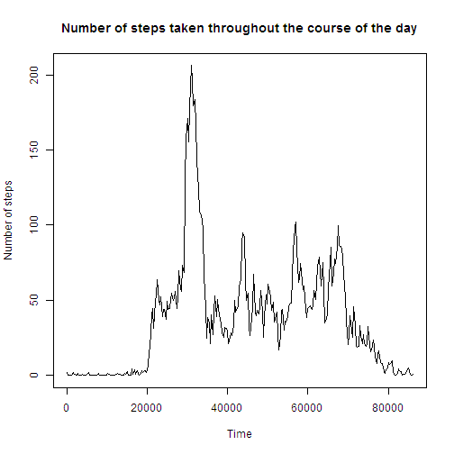
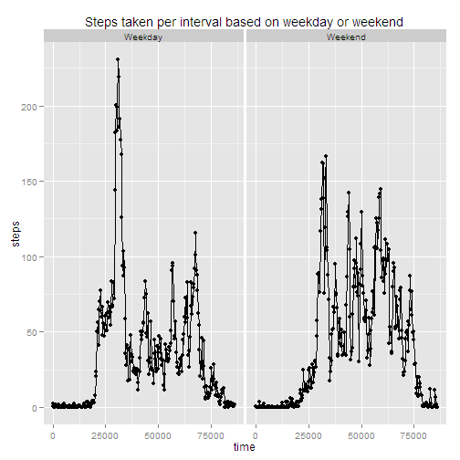

# Reproducible Research: Peer Assessment 1


## Loading and preprocessing the data

In this code chunk, we read the .csv file into R and
reformat the date column to be recognized as dates
by R.

```r
data<-read.csv(unzip("activity.zip"), header=TRUE)
data$date<-as.Date(data$date)
```

## What is mean total number of steps taken per day?

In this code chunk, we develop a histogram of steps
taken per day using the aggregate command. We also
find the mean and median number of steps taken per
day.

```r
newdata<-aggregate(steps ~ date, data=data, FUN=sum)
library(lattice)
histogram(newdata$steps, main="Histogram of number of steps taken per day", xlab="number of steps", ylab="frequency")
```

 

```r
meanvalue<-mean(newdata$steps)
medianvalue<-median(newdata$steps)
```

The mean number of steps taken per day is 1.0766 &times; 10<sup>4</sup> steps. The median number of steps is 10765 steps. 

## What is the average daily activity pattern?

In this code chunk, we develop a line graph that 
shows the mean number of steps walked in each time 
interval.

```r
linedata<-aggregate(steps ~ interval, data=data, FUN=mean)
plot(x=linedata$interval, y=linedata$steps, type="l", xlab="Time", ylab="Number of steps", main="Number of steps taken throughout the course of the day")
```

 

```r
time<-linedata[linedata$steps==max(linedata$steps),][1]
```

The five minute interval starting at minute 835 is the time at which the most steps are taken. 

## Imputing missing values

Imputation was done by determining the mean value for each five minute interval and inserting that in the appropriate position.


```r
totalNAs<-sum(is.na(data))
complete<-complete.cases(data)
data$complete<-complete
NAdata<-data[data$complete==FALSE,]
NAdatafill<-merge(linedata, NAdata, by="interval")
cleaneddata<-na.omit(data)
NAdatafill$steps.y<-NULL
names(NAdatafill)[2]<-"steps"
finaldata<-rbind(cleaneddata,  NAdatafill)
finaldata<-finaldata[order(finaldata$date),]
finaldata$complete<-NULL
new2data<-aggregate(steps ~ date, data=finaldata, FUN=sum)
library(lattice)
histogram(new2data$steps, main="Histogram of number of steps taken per day with imputed data", xlab="number of steps", ylab="frequency")
```

 

```r
mean2<-mean(new2data$steps)
median2<-median(new2data$steps)
```

The number of missing values replaced was 2304.
The mean number of steps walked per day is 1.0766 &times; 10<sup>4</sup>. 
The median number of steps walked per day is 1.0766 &times; 10<sup>4</sup>. Using imputed data, we find the mean is 
much closer to the mean. We additionally find that
in the histogram, the middle is much higher than
it was when nonimputed data was used.

## Are there differences in activity patterns between weekdays and weekends?


```r
weekday<-weekdays(finaldata$date)
finaldata$weekday<-weekday
finaldata$weekday<-gsub("Monday", "Weekday", finaldata$weekday)
finaldata$weekday<-gsub("Tuesday", "Weekday", finaldata$weekday)
finaldata$weekday<-gsub("Wednesday", "Weekday", finaldata$weekday)
finaldata$weekday<-gsub("Thursday", "Weekday", finaldata$weekday)
finaldata$weekday<-gsub("Friday", "Weekday", finaldata$weekday)
finaldata$weekday<-gsub("Saturday", "Weekend", finaldata$weekday)
finaldata$weekday<-gsub("Sunday", "Weekend", finaldata$weekday)
library(ggplot2)
finaldata$weekday<-as.factor(finaldata$weekday)
potential<-aggregate(steps ~ interval+weekday, data=finaldata, FUN=mean)
qplot(interval, steps, data=potential, facets=.~weekday, main="Steps taken per interval based on weekday or weekend", xlab="time")+geom_line()
```

 

We notice that there is less walking per time interval on weekends, but it appears like more walking throughout the day. On weekdays, people take a lot of steps early in the morning but then fewer steps throughout the workday.
